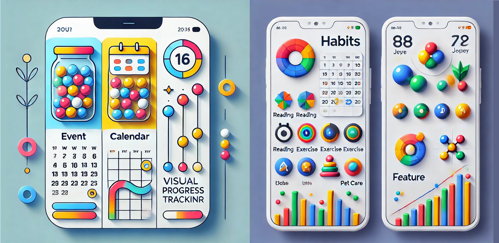

# droplets

Capture every moment, celebrate every persistence

This app is a powerful tool for event tracking and visual management, helping users monitor their daily activities and habit formation in an intuitive and engaging way. Users can create personalized events, such as reading, exercising, or freelancing, and mark them with icons and colors. Each completed event generates a bead representing the activity, which drops into a storage bottle, creating a clear and visualized record of growth and persistence.

Key Features:
	1.	Event Creation – Users can freely add events and customize them with icons and colors.
	2.	Visualized Tracking – Each completed event generates a corresponding bead, displayed in the record bottle to enhance motivation.
	3.	Data Statistics – View records by day or month to review and analyze habit patterns.
	4.	Calendar View – Display event records on a calendar for easy habit tracking over time.
	5.	Detailed Logs – Check execution time and frequency of each event for precise progress tracking.
	6.	Bottom Navigation – Easily switch between different views, including the record bottle, list, and calendar, for a smooth user experience.
 Applicable Scenarios:
	•	Habit Formation – Track activities like reading, exercise, or meditation to boost motivation through visualization.
	•	Goal Tracking – Monitor tasks such as freelancing or attending courses, ensuring clear progress tracking.
	•	Emotional Logging – Record feelings like happiness or sadness and review mood changes over time.

Future Plans:
	•	Enhanced Data Analysis – Introduce trend charts and statistics to help users optimize their habits.
	•	Personalized Themes – Support customizable color schemes and interface styles.
	•	Improved Interaction – Optimize bead drop animations and add social sharing features.

This app is designed to help users effortlessly record life’s moments and make persistence more fun!
